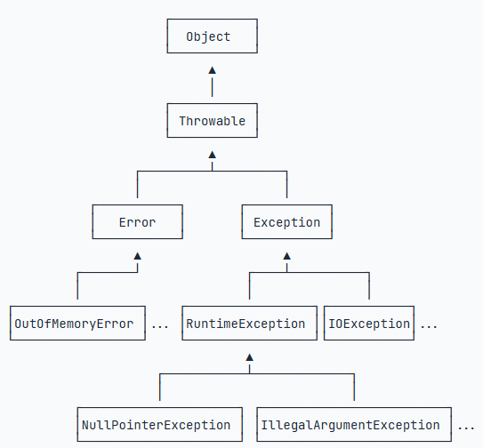

### Java 异常处理

---

#### 1、异常体系
异常继承关系如下图：



从继承关系可知：Throwable是异常体系的根，它继承自Object。
Throwable有两个体系：Error和Exception，Error表示严重的错误，程序对此一般无能为力，例如：
- OutOfMemoryError：内存耗尽
- NoClassDefFoundError：无法加载某个Class
- StackOverflowError：栈溢出
而Exception则是运行时的错误，它可以被捕获并处理。

某些异常是应用程序逻辑处理的一部分，应该捕获并处理。例如：
- NumberFormatException：数值类型的格式错误
- FileNotFoundException：未找到文件
- SocketException：读取网络失败

还有一些异常是程序逻辑编写不对造成的，应该修复程序本身。例如：
- NullPointerException：对某个null的对象调用方法或字段
- IndexOutOfBoundsException：数组索引越界

Exception又分为两大类： RuntimeException以及它的子类；非RuntimeException（包括IOException、ReflectiveOperationException等等）
Java规定：
- 必须捕获的异常，包括Exception及其子类，但不包括RuntimeException及其子类，这种类型的异常称为Checked Exception。
- 不需要捕获的异常，包括Error及其子类，RuntimeException及其子类。

#### 2、捕获异常
- 捕获异常使用***try...catch***语句，把可能发生异常的代码放到try {...}中，然后使用catch捕获对应的Exception及其子类。
```aiignore
// try...catch
import java.io.UnsupportedEncodingException;
import java.util.Arrays;

public class Main {
    public static void main(String[] args) {
        byte[] bs = toGBK("中文");
        System.out.println(Arrays.toString(bs));
    }

    static byte[] toGBK(String s) {
        try {
            // 用指定编码转换String为byte[]:
            return s.getBytes("GBK");
        } catch (UnsupportedEncodingException e) {
            // 如果系统不支持GBK编码，会捕获到UnsupportedEncodingException:
            System.out.println(e); // 打印异常信息
            return s.getBytes(); // 尝试使用默认编码
        }
    }
}
```
- 在方法定义的时候，使用throws Xxx表示该方法可能抛出的异常类型。调用方在调用的时候，必须强制捕获这些异常，否则编译器会报错。
- 可以使用多个catch语句，每个catch分别捕获对应的Exception及其子类。JVM在捕获到异常后，会从上到下匹配catch语句，匹配到某个catch后，执行catch代码块，然后不再继续匹配。
简单地说就是：多个catch语句只有一个能被执行。例如：
```
public static void main(String[] args) {
    try {
        process1();
        process2();
        process3();
    } catch (IOException e) {
        System.out.println(e);
    } catch (NumberFormatException e) {
        System.out.println(e);
    }
}
```
- 存在多个catch的时候，catch的顺序非常重要：子类必须写在前面。
- Java的try ... catch机制还提供了finally语句，finally语句块保证有无错误都会执行。
- 捕获多种异常，用|合并到一起，例如：
```aiignore
public static void main(String[] args) {
    try {
        process1();
        process2();
        process3();
    } catch (IOException | NumberFormatException e) {
        // IOException或NumberFormatException
        System.out.println("Bad input");
    } catch (Exception e) {
        System.out.println("Unknown error");
    }
}
```

#### 3、抛出异常
- 如何抛出异常？参考Integer.parseInt()方法，抛出异常分两步：
  - 创建某个Exception的实例
  - 用throw语句抛出
```aiignore
void process2(String s) {
    if (s==null) {
        NullPointerException e = new NullPointerException();
        throw e;
    }
}
```
- 当某个方法抛出了异常时，如果当前方法没有捕获异常，异常就会被抛到上层调用方法，直到遇到某个try ... catch被捕获为止：
```aiignore
// exception
public class Main {
    public static void main(String[] args) {
        try {
            process1();
        } catch (Exception e) {
            e.printStackTrace();
        }
    }

    static void process1() {
        process2();
    }

    static void process2() {
        Integer.parseInt(null); // 会抛出NumberFormatException
    }
}
```
通过printStackTrace()可以打印出方法的调用栈.
- 如果finally抛出异常，原来在catch中准备抛出的异常就“消失”了，因为只能抛出一个异常。没有被抛出的异常称为“被屏蔽”的异常（Suppressed Exception）。
- 如何保存所有的异常信息？方法是先用origin变量保存原始异常，然后调用Throwable.addSuppressed()，把原始异常添加进来，最后在finally抛出：
```aiignore
// exception
public class Main {
    public static void main(String[] args) throws Exception {
        Exception origin = null;
        try {
            System.out.println(Integer.parseInt("abc"));
        } catch (Exception e) {
            origin = e;
            throw e;
        } finally {
            Exception e = new IllegalArgumentException();
            if (origin != null) {
                e.addSuppressed(origin);
            }
            throw e;
        }
    }
}
```
通过Throwable.getSuppressed()可以获取所有的Suppressed Exception。

#### 3、自定义异常
- 一个常见的做法是自定义一个BaseException作为“根异常”，然后，派生出各种业务类型的异常。
BaseException需要从一个适合的Exception派生，通常建议从RuntimeException派生：
```aiignore
public class BaseException extends RuntimeException {
}
```
- 其他业务类型的异常就可以从BaseException派生：
```aiignore
public class UserNotFoundException extends BaseException {
}

public class LoginFailedException extends BaseException {
}
```
- 自定义的BaseException应该提供多个构造方法：
```aiignore
public class BaseException extends RuntimeException {
    public BaseException() {
        super();
    }

    public BaseException(String message, Throwable cause) {
        super(message, cause);
    }

    public BaseException(String message) {
        super(message);
    }

    public BaseException(Throwable cause) {
        super(cause);
    }
}
```


