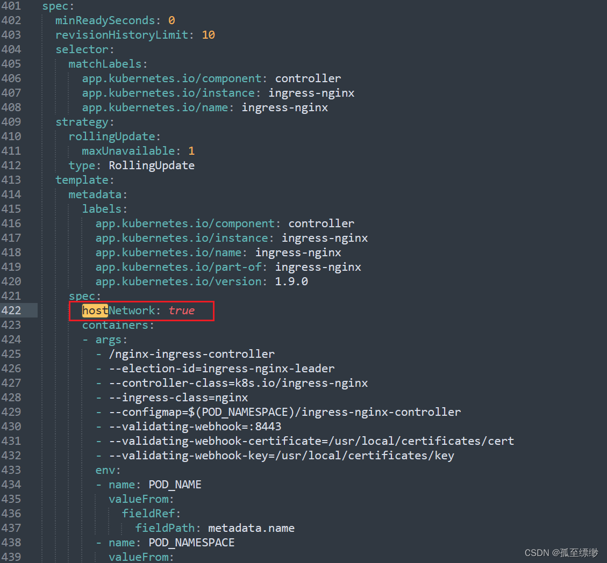
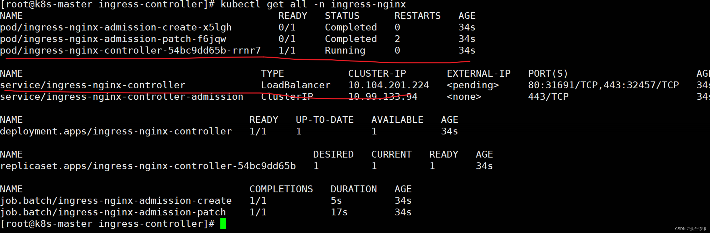

### 部署ingress-nginx-controller

---

- 版本资源对照列表

```
https://github.com/kubernetes/ingress-nginx
```

- 下载部署文档
```
wget https://raw.githubusercontent.com/kubernetes/ingress-nginx/controller-v1.9.0/deploy/static/provider/baremetal/deploy.yaml
```
注意： 如果deploy.yaml中的镜像拉取不下来，查找可用的ingress-nginx-controller和kube-webhook-certgen镜像，并替换

- 添加**hostNetwork: true**。 若不添加，后续使用 **域名:nodeport** 访问；添加之后，直接使用域名访问。


- 部署ingress-nginx-controller
```shell
kubectl apply -f deploy.yaml
kubectl get all -n ingress-nginx
```

